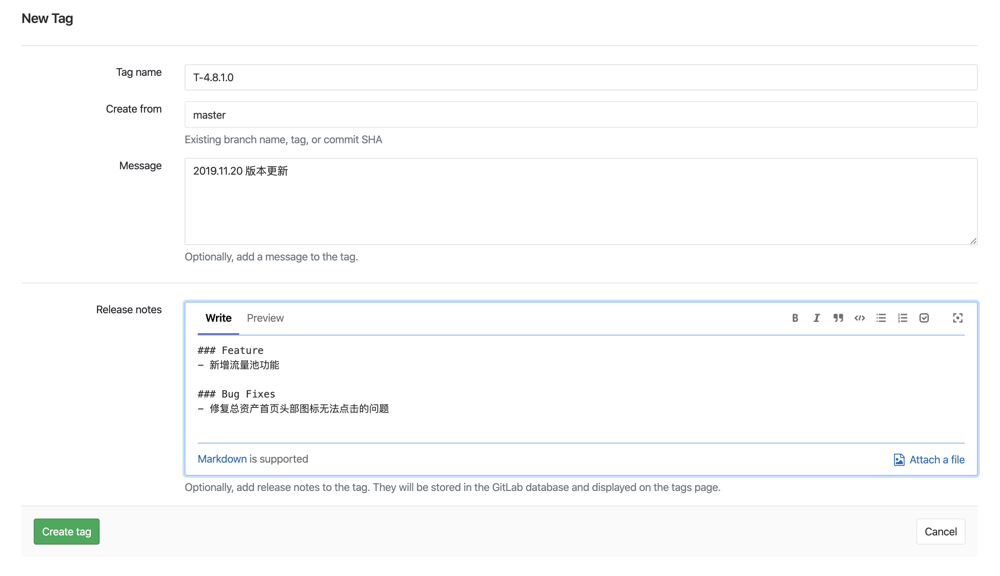

# Tag创建规范

在Gitlab协作中, 当我们的版本上线完毕之后, 需要备份当前版本的代码方便日后回滚或进行其他操作, 需要用到 Gitlab 中的 tag 功能。

在创建tag时，请遵循以下的规范：

tag信息填写范例：



## Tag name

以大写字母 `T` 开头, 以 `-` 为分隔符, 四位版本号结尾。

示例：`T-4.8.1.0`

`T` 表示此名称为一个标签名, 4.8.1.0 表示应用对外版本号为4.8.1, 第四位为内部开发版本号, 一般在修复线上问题的版本发布时会叠加第四位版本号。

## Create from

正常情况下 `Tag` 一般基于master分支创建, 特殊情况下也可选择其他分支。

## Message

标签描述，用于简短地描述标签信息。

格式为日期 + 版本类型，类型可选版本更新、问题修复、代码优化等类型。

## Release notes

版本内容记录，支持markdown, 一般使用三级标题的类型+更新内容组合。

类型可选：

- Feature
- Bug Fixes
- Refactor
- Perf
- Chore

示例：

```markdown
### Feature
- 新增流量池功能

### Bug Fixes
- 修复总资产首页头部图标无法点击的问题
```
